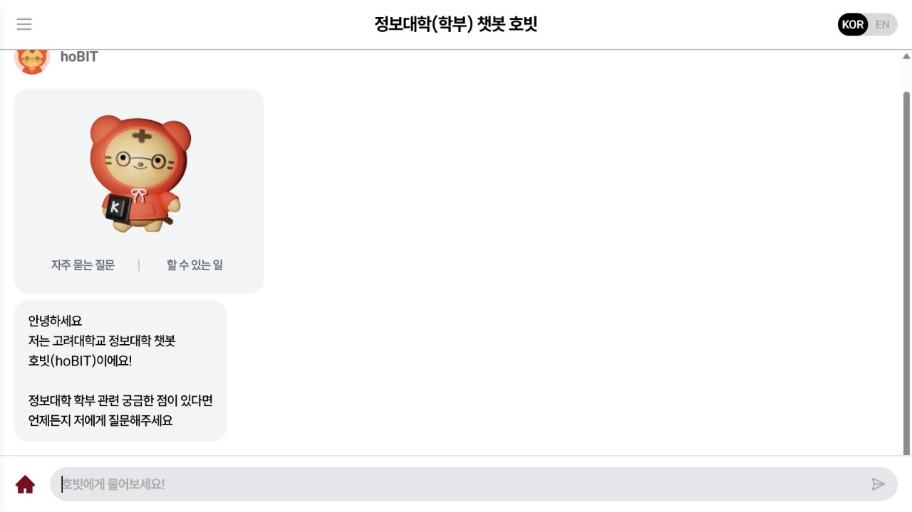
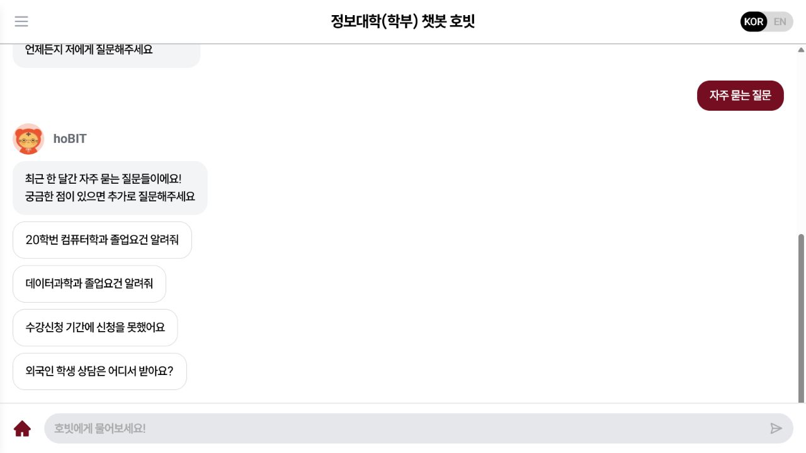
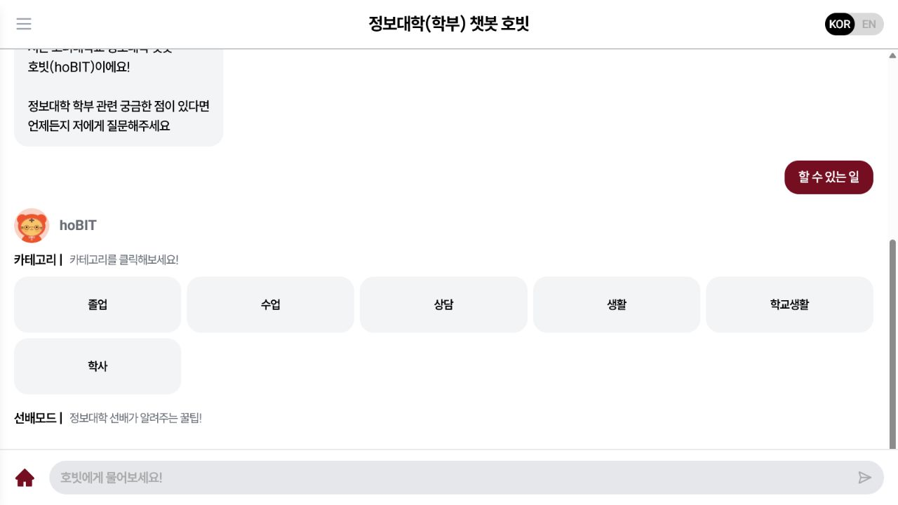
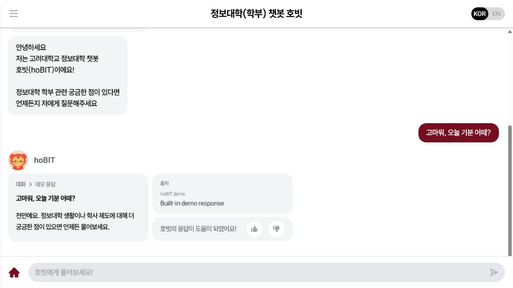
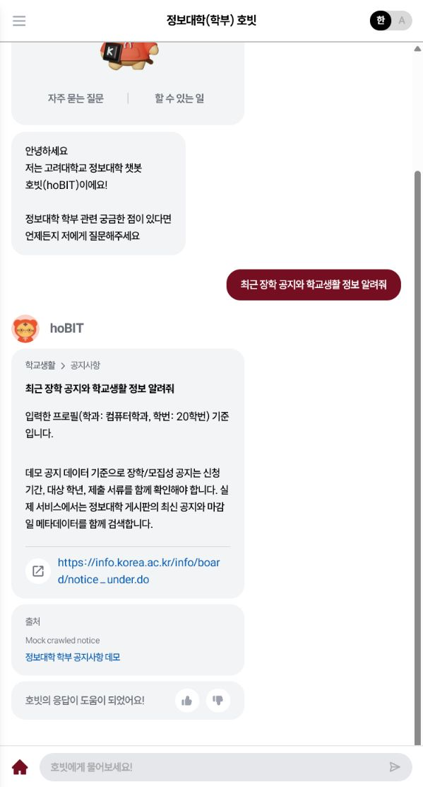
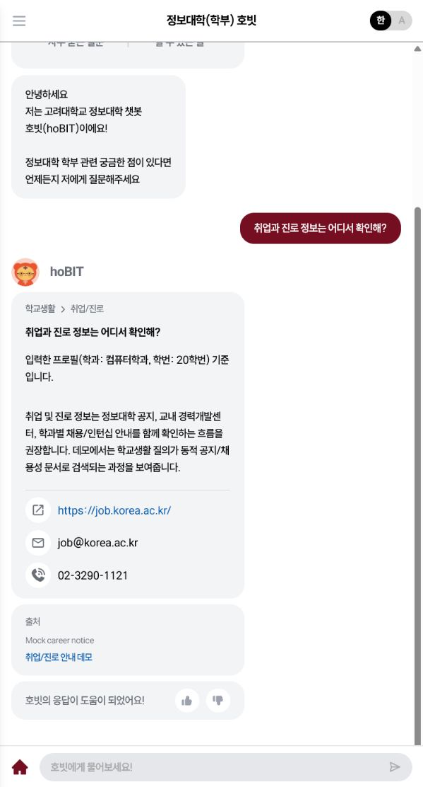
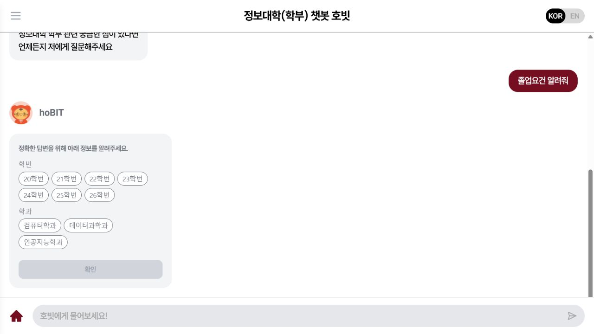
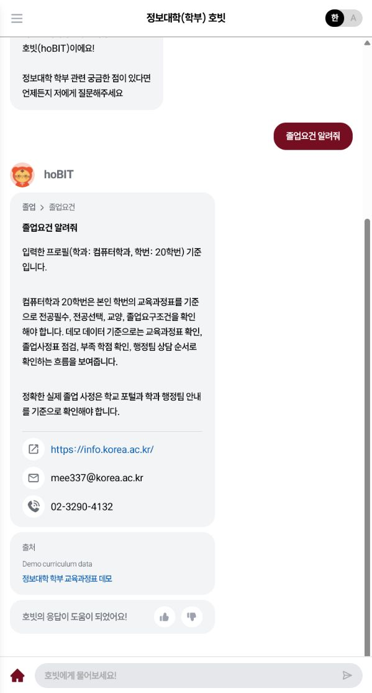
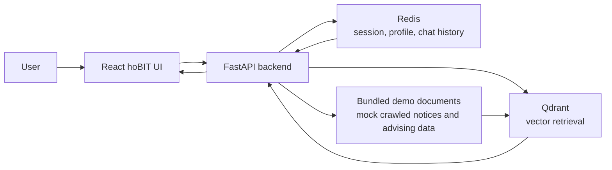

# hoBIT EMNLP Demo

English | [한국어](#한국어)

<p align="center">
  
</p>

<p align="center">
  <a href="https://github.com/hobit-emnlp/hobit-emnlp"></a>
  <a href="https://github.com/hobit-emnlp/hobit-emnlp/archive/refs/heads/main.zip"></a>
  
  
  
  
</p>

hoBIT is a Korean academic-advising chatbot for the Korea University College of Informatics. This repository is the reproducible EMNLP demo package: it preserves the paper-style system architecture with a React chat UI, FastAPI service, Redis session/profile memory, and Qdrant vector retrieval, while replacing private database dependencies with bundled demo data.

## Demo Link / Installable Package

- GitHub repository: <https://github.com/hobit-emnlp/hobit-emnlp>
- Downloadable installation package: <https://github.com/hobit-emnlp/hobit-emnlp/archive/refs/heads/main.zip>
- Local demo after install: <http://localhost:3000>
- Backend health check: <http://localhost:8000/health>

If a public live URL is not attached to the submission, this repository and ZIP archive serve as the installable demo package required by the EMNLP demo track.

## What Does This Do?

hoBIT answers university-life and academic-policy questions in a chat interface. The demo includes:

- greeting and guided entry points;
- frequently asked questions;
- ability/features explanation;
- smalltalk fallback responses;
- campus-life retrieval over notice/career data;
- profile-dependent academic advising through dual asking;
- source cards that expose where each answer came from.

The bundled dataset is intentionally small, but the runtime path still exercises Qdrant indexing/search and Redis-backed profile/session memory.

## Demo Screenshots

| FAQ | Abilities |
| --- | --- |
|  |  |

| Smalltalk | Campus Life |
| --- | --- |
|  |  |

| Career / Jobs | Dual Asking |
| --- | --- |
|  |  |

| Profile-Conditioned Academic Answer |
| --- |
|  |

## Use

### Docker Compose

Requirements:

- Docker Desktop or Docker Engine
- Docker Compose v2

```bash
git clone https://github.com/hobit-emnlp/hobit-emnlp.git
cd hobit-emnlp
docker compose up --build
```

Open:

- Frontend: <http://localhost:3000>
- Backend health: <http://localhost:8000/health>
- Qdrant dashboard/API: <http://localhost:6333/dashboard>

Docker Compose starts four services:

- `frontend`: React hoBIT chat UI
- `backend`: FastAPI API server
- `qdrant`: vector index for bundled advising documents
- `redis`: session/profile store for dual asking

### Local Development

Start Qdrant and Redis first, or use the Docker Compose services above.

Backend:

```bash
cd backend
python -m venv .venv
.venv\Scripts\activate  # Windows
pip install -r requirements.txt
set QDRANT_URL=http://localhost:6333
set REDIS_URL=redis://localhost:6379/0
uvicorn app.main:app --host 0.0.0.0 --port 8000 --reload
```

Frontend:

```bash
cd frontend
cp .env.example .env
npm ci
npm start
```

The frontend uses `REACT_APP_HOBIT_BACKEND_ENDPOINT`, defaulting to `http://localhost:8000`.

## Demo Script

Use the Korean UI.

1. Open <http://localhost:3000>.
2. Greeting: `안녕하세요`
3. FAQ: click `자주 묻는 질문` or ask `자주 묻는 질문`
4. Abilities: click `할 수 있는 일`
5. Smalltalk: `고마워, 오늘 기분 어때?`
6. Campus life: `최근 장학 공지와 학교생활 정보 알려줘`
7. Career: `취업과 진로 정보는 어디서 확인해?`
8. Dual asking: ask `졸업요건 알려줘`, select `20학번` and `컴퓨터학과`, then confirm.

The final graduation answer should mention that it is conditioned on the selected profile.

## System Architecture



The production paper system may connect to larger crawled corpora, MySQL-backed internal records, and LLM generation. This demo keeps the same architectural roles while making review reproducible without private credentials or databases.

## Repository Layout

```text
.
├── backend/             # FastAPI, Redis session logic, Qdrant retrieval, bundled demo data
├── frontend/            # React hoBIT chat UI
├── docs/assets/         # Captured demo screenshots used in this README
├── scripts/             # Smoke-test helper scripts
├── docker-compose.yml   # One-command installable demo
└── README.md
```

## API Smoke Test

After the backend is running:

```bash
curl http://localhost:8000/health
curl -X POST http://localhost:8000/api/v0/question \
  -H "Content-Type: application/json" \
  -H "X-Session-ID: demo" \
  -d "{\"question\":\"졸업요건 알려줘\",\"language\":\"KO\"}"
```

The first graduation query should request profile fields. Then save a profile:

```bash
curl -X POST http://localhost:8000/api/v0/profile \
  -H "Content-Type: application/json" \
  -H "X-Session-ID: demo" \
  -d "{\"department\":\"컴퓨터학과\",\"admission_year\":20,\"language\":\"ko\"}"
```

Repeat the graduation question to receive a profile-conditioned answer.

## Reproducibility Notes

- No private MySQL dump is required.
- No university-internal credentials are required.
- No OpenAI or other LLM API key is required.
- Qdrant and Redis are real services in the demo stack.
- `backend/data/demo_documents.json` contains local/mock documents, including notice, career, and academic-advising examples.
- The original hoBIT frontend interaction pattern is preserved.

## Citation

If this demo is used in academic work, please cite the associated EMNLP demo paper once the final citation is available.

## 한국어

이 저장소는 EMNLP demo track 제출을 위한 hoBIT 재현 패키지입니다. 논문에서 강조한 React UI, FastAPI, Redis, Qdrant 기반 구조는 유지하고, 비공개 MySQL 데이터와 내부 인프라는 `backend/data/demo_documents.json`의 로컬/모의 데이터로 대체했습니다.

빠른 실행:

```bash
git clone https://github.com/hobit-emnlp/hobit-emnlp.git
cd hobit-emnlp
docker compose up --build
```

실행 후 <http://localhost:3000>에서 데모를 확인할 수 있습니다.
