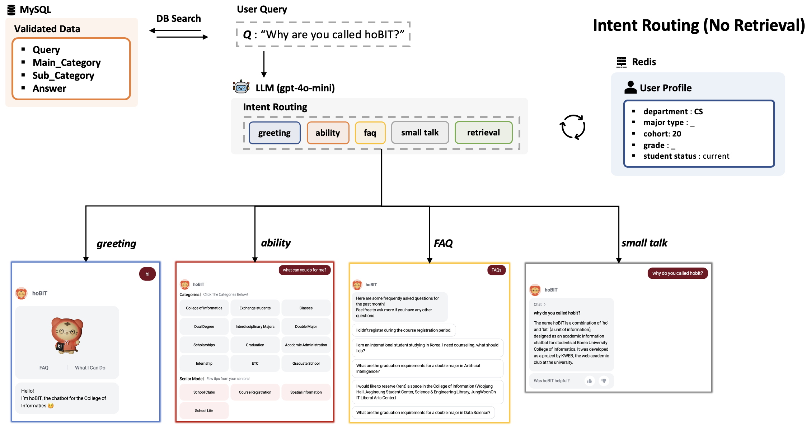
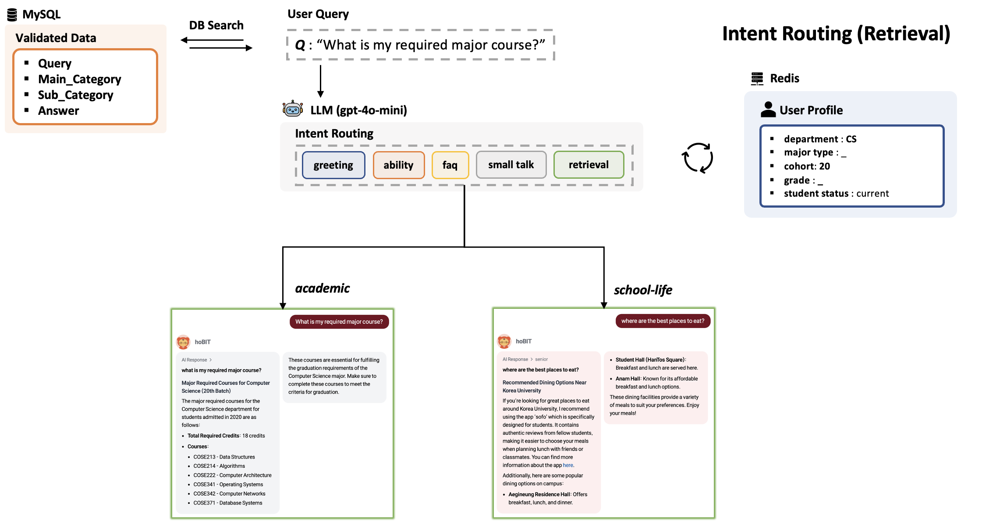
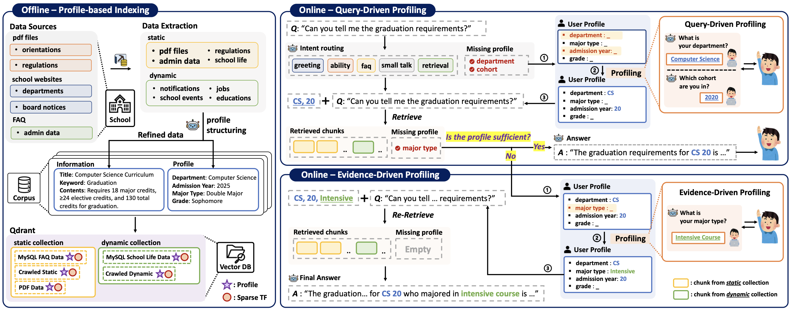
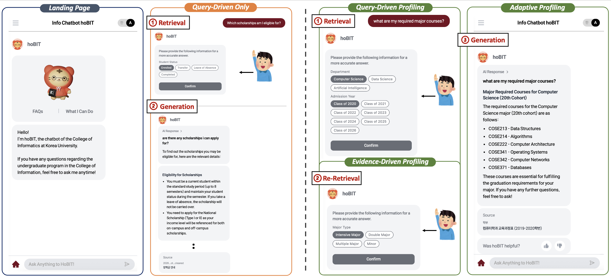

# 2026-EMNLP-DEMO

**hoBIT-AX with proFILL — Profile-Aware RAG for Academic Advising**

<p align="center">
  
</p>

<p align="center">
  <a href="https://github.com/hobit-emnlp/hobit-emnlp"></a>
  <a href="https://github.com/hobit-emnlp/hobit-emnlp/archive/refs/heads/main.zip"></a>
  
  
  
  
</p>

hoBIT-AX extends the existing rule-based hoBIT chatbot (Korea University College of
Informatics) with **proFILL** — a profile-aware RAG methodology. Each answer is
conditioned on the student's structured profile (department, admission year, major
type, grade, status), so questions like "please tell me my required major courses" resolve to the correct year-specific curriculum table rather than a generic response.

- **Live install package**: <https://github.com/hobit-emnlp/hobit-emnlp/archive/refs/heads/main.zip>
- **Project page**: <https://hobit-emnlp.github.io/>
- **Local demo after install**: <http://localhost:3000>
- **Backend health check**: <http://localhost:8000/health>

---

## Intent Routing

<p align="center">
  
  &nbsp;
  
</p>

A lightweight classifier routes every user query into one of five intents:

| Intent | Handling |
|---|---|
| `greeting` | Fixed greeting response |
| `ability` | Feature menu (what hoBIT can answer) |
| `faq` | FAQ list from the admin backend |
| `smalltalk` | Short fallback reply |
| `retrieval` | Enters the proFILL profile-aware RAG pipeline |

The router reaches **96.0% accuracy** on 1,600 evaluation queries (academic F1 0.99).
Only `retrieval` traffic invokes retrieval, so non-academic turns stay cheap and
predictable.

---

## Architecture

<p align="center">
  
</p>

proFILL is built on two layers:

- **Offline profile-based indexing** — Documents are chunked and stored in Qdrant with
  structured profile facets (departmennt, admission year, major type, grade, status) attached to each chunk's payload. This allows hard-filter narrowing before dense/sparse scoring at query time.
- **On-demand adaptive profiling** — When a query enters, the pipeline decides whether
  the current session profile is sufficient to answer:
  - **Query-driven probing**: if the query implies a profile-dependent answer, hoBIT asks the student for the missing fields upfront.
  - **Evidence-driven probing**: after the first retrieval, if the top-k evidence still doesn't cover the student-specific answer, hoBIT asks for additional profile fields and re-retrieves.

Adaptive profiling is triggered for **24.3% of queries** in our setup; every trigger
causes a fresh retrieval so that profile changes shift the top-k documents rather than
merely reshaping the LLM prompt.

---

## User Interaction

<p align="center">
  
</p>

The React UI preserves hoBIT's original interaction patterns. When the academic path requires a profile, the UI presents a card-based profile probe, and the answer is regenerated grounded on the updated profile with cited source tags (`[S1]`, `[S2]`, …).

---

## Use

### Docker Compose

Requirements:

- Docker Desktop or Docker Engine
- Docker Compose v2

```bash
git clone https://github.com/hobit-emnlp/hobit-emnlp.git
cd hobit-emnlp
docker compose up --build
```

Open:

- Frontend: <http://localhost:3000>
- Backend health: <http://localhost:8000/health>
- Qdrant dashboard/API: <http://localhost:6333/dashboard>

Docker Compose starts four services:

- `frontend`: React hoBIT chat UI
- `backend`: FastAPI API server
- `qdrant`: vector index for bundled advising documents
- `redis`: session/profile store for adaptive profiling

Optional LLM generation:

```bash
set OPENAI_API_KEY=sk-...
set OPENAI_MODEL=gpt-4o-mini
set USE_LLM_GENERATION=auto
docker compose up --build
```

For PowerShell:

```powershell
$env:OPENAI_API_KEY="sk-..."
$env:OPENAI_MODEL="gpt-4o-mini"
$env:USE_LLM_GENERATION="auto"
docker compose up --build
```

Do not commit API keys into this repository. Keep them in your shell environment,
`.env` file excluded from Git, or a deployment secret manager.

With a valid key, `/health` reports `generation: openai-compatible`; each generated
answer card also includes `"generation": "openai-compatible"` in the API payload.
Without `OPENAI_API_KEY`, `/health` reports `generation: offline-bundled-answer` and
the demo remains fully reproducible without external API credentials.

### Local Development

Start Qdrant and Redis first, or use the Docker Compose services above.

Backend:

```bash
cd backend
python -m venv .venv
.venv\Scripts\activate  # Windows
pip install -r requirements.txt
set QDRANT_URL=http://localhost:6333
set REDIS_URL=redis://localhost:6379/0
uvicorn app.main:app --host 0.0.0.0 --port 8000 --reload
```

If Qdrant/Redis are not available and you only need a local UI/demo capture run,
start the backend with the in-memory fallback:

```powershell
$env:HOBIT_IN_MEMORY_FALLBACK="1"
$env:USE_LLM_GENERATION="off"
uvicorn app.main:app --host 127.0.0.1 --port 8000
```

Frontend:

```bash
cd frontend
cp .env.example .env
npm ci
npm start
```

The frontend uses `REACT_APP_HOBIT_BACKEND_ENDPOINT`, defaulting to `http://localhost:8000`.

## Repository Layout

```text
.
├── backend/             # FastAPI, Redis session logic, Qdrant retrieval, bundled demo data
├── frontend/            # React hoBIT chat UI
├── docs/
│   ├── assets/          # Figures used in this README
│   ├── datasets.md      # Evaluation dataset documentation (4 tracks)
│   └── llm_prompt_judge.md   # LLM judge prompts (Top-3 Precision, Answer Completeness)
├── scripts/             # Smoke-test helper scripts
├── docker-compose.yml   # One-command installable demo
└── README.md
```

## Documentation

- [`docs/datasets.md`](docs/datasets.md) — Evaluation datasets (Profile-based Indexing · Intent Routing · Profile-grounded QA · Open-ended Advising)
- [`docs/llm_prompt_judge.md`](docs/llm_prompt_judge.md) — LLM judge prompts (Top-3 Retrieval Precision, Answer Completeness [GEval])

## API Smoke Test

After the backend is running:

```bash
curl http://localhost:8000/health
curl -X POST http://localhost:8000/api/v0/question \
  -H "Content-Type: application/json" \
  -H "X-Session-ID: demo" \
  -d "{\"question\":\"졸업요건 알려줘\",\"language\":\"KO\"}"
```

The first graduation query should request profile fields. Then save a profile:

```bash
curl -X POST http://localhost:8000/api/v0/profile \
  -H "Content-Type: application/json" \
  -H "X-Session-ID: demo" \
  -d "{\"department\":\"컴퓨터학과\",\"admission_year\":20,\"language\":\"ko\"}"
```

Repeat the graduation question to receive a profile-conditioned answer.

## Reproducibility

Reviewers can run the demo end-to-end without institutional access or paid credentials:

- **No private MySQL dump or university-internal credentials required.** The demo ships
  20-odd mock documents in `backend/data/demo_documents.json` in place of the deployed
  Korea University document store.
- **No OpenAI or other LLM API key required.** Without a key, `/health` reports
  `generation: offline-bundled-answer` and answers are served from bundled canned
  responses. With `OPENAI_API_KEY` set, the backend switches to LLM generation.
- **Qdrant and Redis are real services**, not in-memory mocks — the retrieval pipeline
  runs against the same infrastructure used in production.
- **Interaction pattern is preserved.** The React UI (greeting → FAQ → smalltalk →
  advising) mirrors the deployed hoBIT chat flow, so reviewer traces match paper
  screenshots.

## Citation

If this demo is used in academic work, please cite the associated EMNLP 2026 demo
paper once the final citation is available.
