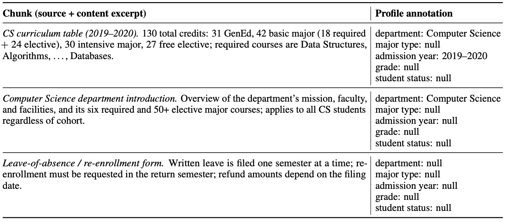
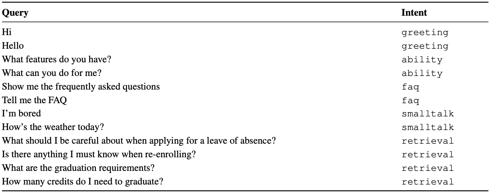
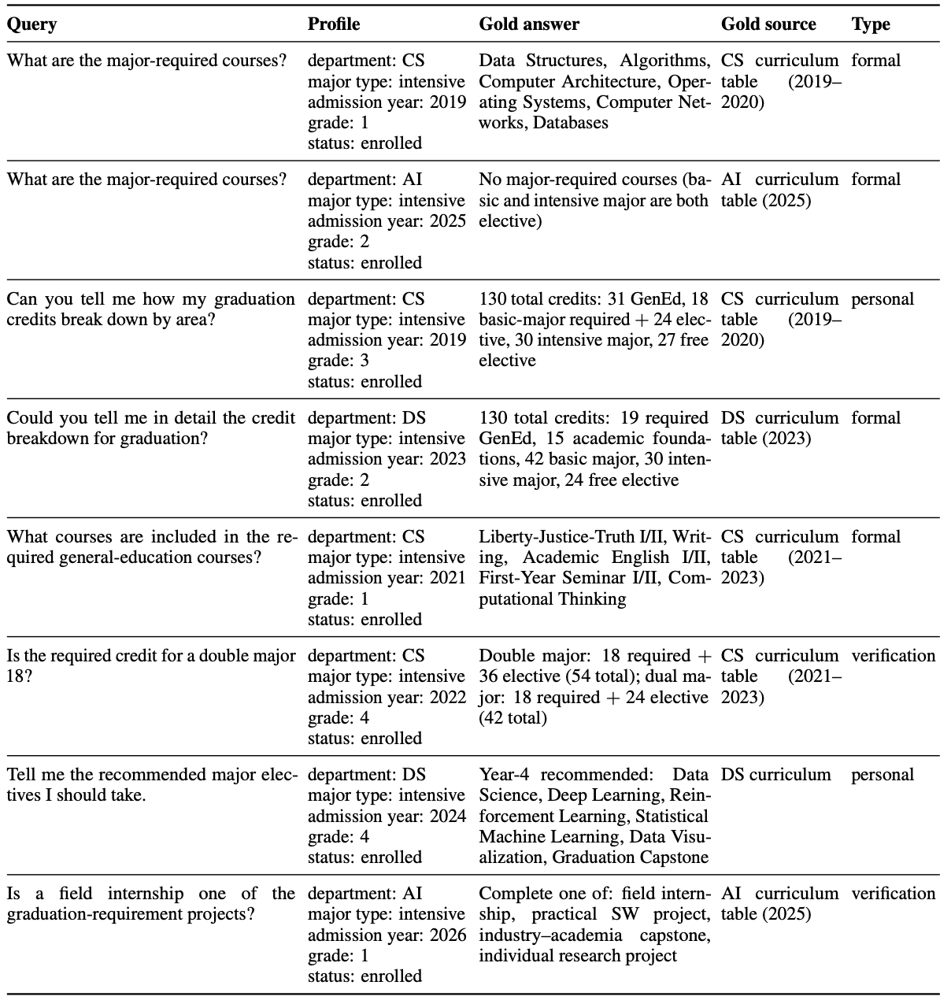
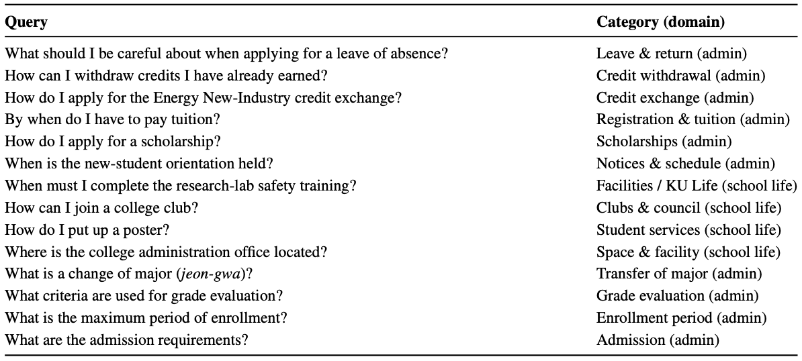

# Datasets

Four evaluation tracks were constructed for hoBIT-AX, each targeting a distinct capability
of the proFILL profile-aware RAG pipeline.

| Track | Size | Purpose |
|---|---:|---|
| **Profile-based Indexing** | — | Static offline indexing over profile-conditioned document facets |
| **Intent Routing** | 1,600 | 5-class routing (greeting / ability / faq / smalltalk / academic) |
| **Profile-grounded QA** | 1,800 | Verifiable QA under known student profiles |
| **Open-ended Advising** | 1,200 | Open-ended retrieval quality without ground-truth documents |

All datasets were generated with `gpt-4o-mini` (temperature=0.7) using anchors extracted
from real hoBIT RASA deployment logs (2024–2025) as seed material.

---

## 1. Profile-based Indexing

  

Static Qdrant index built offline. Each document chunk is tagged with structured profile
facets (department, admission year, major type, grade, student status) so that on-demand
retrieval can restrict the candidate space using hard filters before dense/sparse scoring.
Unset facets remain `null` so that generic administrative documents remain retrievable
by any student, while curriculum tables narrow to the correct cohort.

---

## 2. Intent Routing (n=1,600)

  

Five-class dataset for the routing layer that decides whether a query enters the RAG
pipeline (`retrieval`) or is served by a lightweight response path
(`greeting` · `ability` · `faq` · `smalltalk`).

| Source | Count | Method |
|---|---:|---|
| Manual seed | 22 | Representative utterances per non-academic intent |
| LLM augmentation | 378 | GPT-4o-mini expansion to 100 per non-academic intent |
| Open-ended reuse | 1,200 | Open-ended advising track relabeled as `retrieval` |

Final accuracy: **96.0%** (academic F1 0.99, FAQ F1 0.985).

---

## 3. Profile-grounded QA (n=1,800)

  

Constructed as `60 unique profiles × 10 categories × 3 types = 1,800` cases, where each
case's ground-truth answer is anchored to a specific curriculum-table chunk that matches
the profile (admission year, department, major type).

Three query types per profile-category cell:
- **formal** — standard advising question in a formal register.
- **personal** — question framed around the student's own situation.
- **verification** — yes/no or containment checks against the ground-truth requirement.

---

## 4. Open-ended Advising (n=1,200)

  

Twelve top-level categories × ten sub-categories × ten queries. The taxonomy was
designed to cover Qdrant document domains that the profile-grounded track does not
address (facilities · scholarships · course registration · career · etc.), so the two
tracks are complementary and non-overlapping.

Anchor validation against 797 real user log utterances:

| Axis | Value | Interpretation |
|---|---:|---|
| Category coverage | **14 / 15 (93.3%)** | Practical full coverage |
| Pearson r (top-8 ratios) | **0.65** | Strong distributional alignment with real logs |
| Semantic coverage @ θ=0.5 | **82.4%** | Dense embedding-space overlap under `text-embedding-3-small` — the same model used by the deployed Qdrant retrieval index |

The `text-embedding-3-small` overlap is retrieval-relevant, not merely surface-lexical,
because the deployed hoBIT retrieval index uses the same embedding model.
